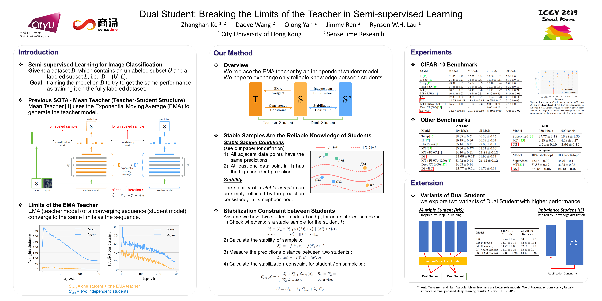

# Dual Student: Breaking the Limits of the Teacher in Semi-Supervised Learning


This is the PyTorch implementation for our paper [Dual Student: Breaking the Limits of the Teacher in Semi-supervised Learning](https://arxiv.org/abs/1909.01804). 
The style of code follows the official implementation of [Mean Teacher](https://github.com/CuriousAI/mean-teacher) (Code from their repository is inside the folder `./third_party/mean_teacher`). 


## Updates
[May 15, 2020] Update code of 'Multiple Student for semi-supervised learning on CIFAR benchmark'.

[Mar 27, 2020] Update log storage function, which allows the log to be stored via `logging.FileHandler`.

[Nov 20, 2019] Update code of 'Dual Student for domain adaptation from USPS to MNIST'.

[Oct 30, 2019] Update ICCV 2019 poster.

[Sep 13, 2019] Update code of 'Dual Student for semi-supervised learning on CIFAR benchmark'.

## Poster


## Preparation
This code runs on Python 3 with PyTorch 0.3.1. If you use Anaconda 3:
1. Create a new python environment and switch to it:
    ```
    conda create -n dual_student python=3.5
    source activate dual_student
    ```

2. Install PyTorch 0.3.1:
    ```
    conda install pytorch=0.3.1 torchvision cudaXX -c pytorch
    ```
    \* Please replace ''cudaXX'' by your cuda version, e.g., ''cuda80'' for cuda 8.0.

3. Install other dependencies:
    ```
    pip install numpy scipy pandas tqdm matplotlib
    ```

4. Clone this repository by:
    ```
    git clone https://github.com/ZHKKKe/DualStudent.git
    ```
    \* Line 258-341 in file `./dual_student.py` is the code of stabilization constraint.


## Experiments

### Semi-Supervised Learning with Dual Student
Running on the CIFAR benchmark with 1 GPU:
1. Switch to the project folder `./DualStudent` and prepare the CIFAR dataset by following commands:
    ```
    ./third_party/data-local/bin/prepare_cifar10.sh
    ./third_party/data-local/bin/prepare_cifar100.sh
    ```

2. We provide the pre-trained models for experiments `CIFAR-10 with 1k labels` and `CIFAR-100 with 10k labels`. Please download them from [[link]](https://drive.google.com/drive/folders/1-XOwxK13VOK8e7dlC2CMPN_1aRspy2Wr?usp=sharing) and put them into `./checkpoints`. Then, you can run:
    ```
    python -m scripts.ds_cifar10_1000l_cnn13
    python -m scripts.ds_cifar100_10000l_cnn13
    ```
    \* Naming rule of script/model is ''`[method]_[dataset]_[labels number]_[model archtecture]`''.

3. If you want to train models yourselves, please comment following two lines on scripts as:

    ```
    # 'resume'  : './checkpoints/xxx',
    # 'validation': True,
    ```
    Then, you can run:
    ```
    python -m scripts.ds_cifar10_1000l_cnn13
    python -m scripts.ds_cifar100_10000l_cnn13
    ```

Please use `python dual_student.py --help` to check command line arguments.

### Domain Adaptation with Dual Student
In our paper, we also provide the result of USPS -> MNIST domain adaptation task.
You can train the network to reproduce our result (or you can download the pre-trained model from [[link]](https://drive.google.com/drive/folders/1-XOwxK13VOK8e7dlC2CMPN_1aRspy2Wr?usp=sharing) for validation):

1. Download USPS dataset from [[link]](https://www.kaggle.com/bistaumanga/usps-dataset) and decompress it into `./third_party/data-local/workdir/usps`.

2. Prepare USPS dataset and MNIST dataset by following commands:
    ```
    ./third_party/data-local/bin/prepare_usps.sh
    ./third_party/data-local/bin/prepare_mnist.sh
    ```

3. Reproduce our domain adaptation result by running:
    ```
    python -m scripts.ds_usps_mnist_da
    ```
    \* Naming rule of script/model is ''`[method]_[source domain]_[target domain]_da`''.


### Semi-Supervised Learning with Multiple Student
Running on the CIFAR benchmark with 1 GPU:

1. We provide the pre-trained model for experiment `CIFAR-10 with 1k labels`. Please download it from [[link]](https://drive.google.com/drive/folders/1-XOwxK13VOK8e7dlC2CMPN_1aRspy2Wr?usp=sharing) and put it into `./checkpoints`. Then, you can run:
    ```
    python -m scripts.ms_cifar10_1000l_cnn13
    ```
    \* Naming rule of script/model is ''`[method]_[dataset]_[labels number]_[model archtecture]`''.

3. If you want to train models yourselves, please comment following two lines on scripts as:

    ```
    # 'resume'  : './checkpoints/xxx',
    # 'validation': True,
    ```
    Then, you can run:
    ```
    python -m scripts.ms_cifar10_1000l_cnn13
    ```

## Citation
If you use our method or code in your research, please cite:
```bibtex
@InProceedings{Ke_2019_ICCV,
  author = {Ke, Zhanghan and Wang, Daoye and Yan, Qiong and Ren, Jimmy and Lau, Rynson W.H.},
  title = {Dual Student: Breaking the Limits of the Teacher in Semi-Supervised Learning},
  booktitle = {The IEEE International Conference on Computer Vision (ICCV)},
  month = {October},
  year = {2019}
}
```

## Contact
If you have any questions, please free to contact me by ```kezhanghan@outlook.com```.
